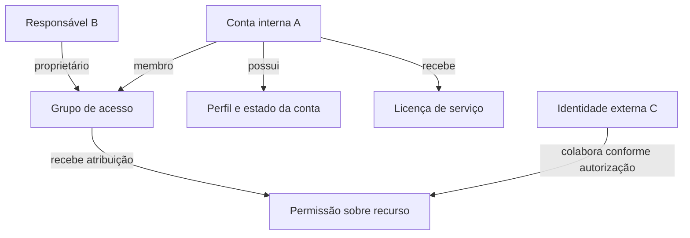
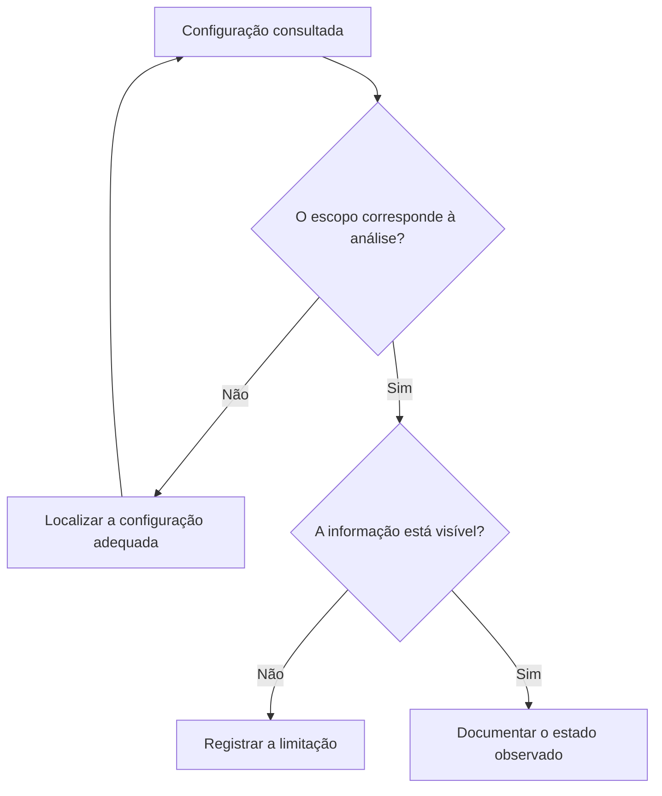
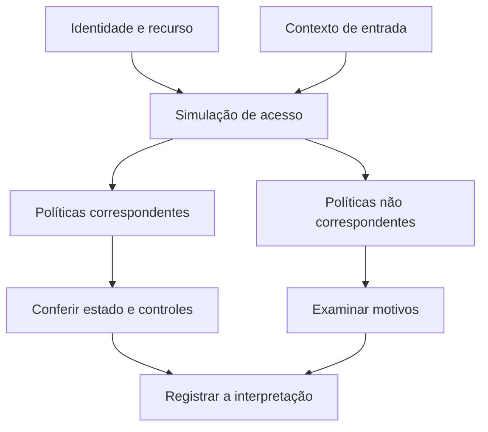

# Microsoft Entra ID — Minha experiência com identidades e acessos

Durante o laboratório associado à credencial **Microsoft Applied Skills: Get started with identities and access using Microsoft Entra**, trabalhei com administração de identidades e análise de configurações de segurança em um ambiente temporário.

Meu objetivo com este registro é explicar o que aprendi e como passei a interpretar as relações entre contas, grupos, permissões e políticas. Essa experiência faz parte do meu desenvolvimento em Gestão de Identidades e Acessos (IAM) e Segurança da Informação.

> **Sobre os gráficos:** os diagramas deste documento foram elaborados após a experiência para explicar os conceitos. Utilizam identificadores genéricos e não reproduzem a estrutura nem os resultados da avaliação. São ilustrações do aprendizado, não capturas ou evidências de execução.

## Credencial

[Consultar minha credencial no Microsoft Learn](https://learn.microsoft.com/pt-br/users/gabrielcerqueira-5326/credentials/6fb739d6d1e917a6)

## Entender o ambiente antes de alterar

Ao trabalhar no ambiente, precisei distinguir duas responsabilidades: administrar objetos e consultar configurações para documentar o estado existente. Essa diferença parece simples, mas muda a maneira de conduzir a atividade. Uma consulta exige cuidado para registrar o que está configurado; uma alteração exige compreender seu efeito sobre o acesso.

Organizei este relato por temas, sem reproduzir a ordem ou os requisitos específicos da avaliação. O ponto de partida foi entender como uma identidade se relaciona com seus atributos, sua participação em grupos e suas permissões.

## Contas, grupos e responsabilidades

O contato com a administração de usuários me ajudou a relacionar o cadastro de uma conta com seu estado de habilitação, atributos e licenciamento. Também trabalhei com o conceito de colaboração externa, em que a identidade convidada precisa ser reconhecida como parte de um contexto de acesso diferente daquele de uma conta interna.

Nos grupos, um aprendizado importante foi separar a participação como membro da responsabilidade como proprietário. Ao documentar essas relações, ficou mais claro que o nome de um grupo não explica, por si só, o acesso que ele oferece: é preciso examinar suas associações e atribuições.

O desenho abaixo usa objetos fictícios para representar essas relações. As setas indicam associação ou responsabilidade, e não uma sequência de configuração.

*Figura 1 — Relações conceituais entre identidades, grupos e acesso. Os objetos são fictícios e não representam o tenant da avaliação.*

## Planejar a atribuição de funções

Uma das dificuldades que encontrei envolveu a relação entre grupos e funções administrativas. A experiência mostrou que certos requisitos precisam ser considerados na criação do objeto, em vez de serem tratados como um ajuste comum posterior.

Esse ponto reforçou um hábito que quero levar para o trabalho: antes de criar um grupo, entender sua finalidade e o tipo de acesso que ele deverá administrar. Também ficou mais evidente a diferença entre uma atribuição de função, a associação a um grupo e a propriedade desse grupo.

Em uma aplicação profissional, esse entendimento ajuda a discutir quem precisa de uma permissão, por qual motivo e em qual escopo. Essa é uma interpretação do aprendizado; o laboratório não representa uma implantação dessa governança em produção.

## Consultar segurança com atenção ao escopo

Na leitura das configurações de senha e autenticação, percebi como é fácil encontrar uma informação relacionada ao tema e assumir que ela responde à consulta inteira. Uma configuração referente a administradores, por exemplo, precisa ser interpretada dentro desse público.

Passei a dar mais atenção a três perguntas: qual configuração estou consultando, a quem ela se aplica e o que a tela realmente permite concluir? O mesmo raciocínio ajudou na leitura das localizações nomeadas, em que é necessário distinguir definições geográficas de definições por intervalos de rede.

O gráfico resume essa forma de conferir uma informação antes de registrá-la:

*Figura 2 — Método de conferência sintetizado a partir do aprendizado. Não representa o fluxo de tarefas da avaliação.*

## Interpretar o Acesso Condicional

A análise com a ferramenta What If foi útil para compreender que o resultado de uma simulação depende do contexto informado. Identidade, recurso e condições de acesso precisam ser considerados em conjunto.

Outro aprendizado foi separar a correspondência de uma política com o cenário de seu estado de imposição. Ver uma política entre os resultados exige examinar também se ela está ativa ou em modo somente relatório. Isso evita transformar uma observação da simulação em uma conclusão indevida sobre o comportamento de um acesso real.

*Figura 3 — Leitura conceitual de uma simulação. Não contém parâmetros, nomes de políticas ou resultados da avaliação.*

Não interpreto essa simulação como prova de autenticação bem-sucedida ou de conformidade de um dispositivo. Ela é uma ferramenta de análise cujo resultado precisa ser lido dentro das entradas utilizadas e das limitações do teste.

## O que levo dessa experiência

O maior ganho foi passar a observar a relação entre as configurações. Criar uma conta, associá-la a um grupo e interpretar uma política são atividades conectadas, mas cada uma responde a uma necessidade diferente.

| Tema | Aprendizado que consolidei |
|---|---|
| Administração de usuários | Relacionar atributos, estado da conta e licenciamento |
| Grupos e funções | Distinguir membros, proprietários e permissões administrativas |
| Colaboração externa | Reconhecer o contexto de uma identidade convidada |
| Senhas e autenticação | Conferir a configuração e o público ao qual ela se aplica |
| Localizações nomeadas | Diferenciar definições por países e por rede |
| Acesso Condicional | Interpretar contexto, correspondência e estado das políticas |
| Documentação técnica | Separar observação, interpretação e informação ainda não confirmada |

## Limites deste registro

Esta experiência ocorreu em um ambiente temporário de avaliação. Não mantenho uma reprodução independente do tenant e não realizei novos testes após o encerramento do ambiente. O repositório documenta meu aprendizado, sem alegar implantação em produção ou disponibilizar um laboratório reproduzível.

Para preservar o conteúdo da avaliação, não foram incluídos enunciados, e-mails, respostas, capturas de tela, parâmetros ou resultados específicos. Também não constam credenciais, domínios, endereços IP ou identificadores do ambiente. A troca de nomes em um print não seria suficiente para preservar o conteúdo técnico da prova; por isso, escolhi representações conceituais.

Como continuidade possível, um cenário próprio permitiria acrescentar evidências reais e anonimizadas de execução, com requisitos independentes e testes documentados. Essa etapa ainda não foi realizada.

---

**Gabriel Cerqueira**  
Registro de aprendizado em Microsoft Entra ID e Gestão de Identidades e Acessos.
